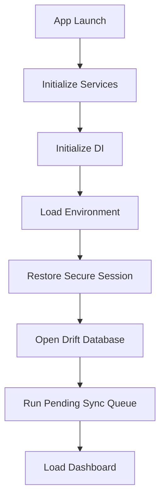

# App Lifecycle & Background Workers

## App Launch Flow

## Background Worker Priorities
1. **Critical**: Sleep Worker
2. **High**: Notification Worker
3. **Medium**: Sync Worker
4. **Low**: Weekly Report
5. **Very Low**: Cleanup
